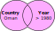

```{r setup, include=FALSE, purl=FALSE}
options(htmltools.dir.version = FALSE, width = 70)
knitr::opts_chunk$set(comment = "##")
```

class: inverse

# But First...
## *Some useful coding tips*

---

# Comments

You may have noticed that sometimes I write code that looks like this:
```{r}
new.object <- 1:10 # Making vector of 1 to 10 
```
`#` is known as the *commenting symbol* in R!

Anything written *after* `#` will not be run by R.

This is useful for annotating your code to remind others (and you!) how your code works.<sup>1</sup>

.footnote[
[1] In R Markdown documents, comments only work in chunks. Outside of a chunk, `#` creates **headers** like "comments" at the top of this slide.
]

---

# Saving Data

You can save an R object on your computer as a file to open later:
```{r}
save(new.object, file="new_object.RData")
```

--

You can open saved files in R as well:
```{r}
load("new_object.RData")
```

--

But where are these files being saved and loaded from?

---

# Working Directories

R saves files and looks for files to open in your current **working directory**. You
can ask R what this is:


```{r}
getwd()
```

--

Similarly, we can set a working directory like so:

```{r, eval=FALSE}
setwd("C:/Users/pearce790/CSSS508/HW2")
```

--

*Don't set a working directory in R Markdown documents!* They automatically set the directory they are in as the working directory.

---

# Managing Files

When managing R projects, it is normally best to give each project (such as a homework
assignment) its own folder. I use the following system:

--

* Every class or project has its own folder
--

* Each assignment or task has a folder inside that, which is the working directory for that item.
--

* `.Rmd` and `.R` files are named clearly and completely

--

For example, this presentation is located and named this:
`GitHub/CSSS508/Lectures/Lecture2/CSSS508_Lecture2_ggplot2.Rmd`

--

You can use whatever system you want, but be consistent so your projects are organized! 
You don't want to lose work by losing or overwriting files!


---

# File Types

We mainly work with four file types in this class:

--

* `.Rmd`: These are **markdown** *syntax* files, where you write code to *make documents*.

--

* `.R`: These are **R** *syntax* files, where you write code to process and analyze data *without making an output document*.

--

* `.html` or `.pdf`: These are the output documents created when you *knit* a markdown document.

--

Make sure you understand the difference between the uses of these file types!

---
class: inverse

# Data

---

# Gapminder Data

We'll be working with data from Hans Rosling's [Gapminder](http://www.gapminder.org) project.
An excerpt of these data can be accessed through an R package called `gapminder`, cleaned and assembled by Jenny Bryan at UBC.

--

In the console: `install.packages("gapminder")`

Load the package and data:
```{r}
library(gapminder)
```

---

# Check Out Gapminder

The data frame we will work with is called `gapminder`, available once you have loaded the package. Let's see its structure:

.small[
```{r}
str(gapminder)
```
]

---

# What's Interesting Here?

* **Factor** variables `country` and `continent`

   + Factors are categorical data with an underlying numeric representation
   + We'll spend a lot of time on factors later!

--

* Many observations: $n=`r nrow(gapminder)`$ rows

--

* For each observation, a few variables: $p=`r ncol(gapminder)`$ columns

--

* A nested/hierarchical structure: `year` in `country` in `continent`

   + These are panel data!

---
class: inverse

# Subsetting Data


---

# Installing Tidyverse

We'll want to be able to slice up this data frame into subsets (e.g. just the rows for Afghanistan, just the rows for 1997).

We will use a package called `dplyr` to do this neatly.

`dplyr` is part of the [tidyverse](http://tidyverse.org/) family of R packages that are the focus of this course.

--

If you have not already installed the tidyverse, type, in the console: `install.packages("tidyverse")`

--

This will install a *large* number of R packages we will use throughout the term, including `dplyr`.

`dplyr` is a very useful and powerful package that we will talk more about soon, but today we're just going to use it for "filtering" data.

---

# Loading dplyr

```{r, message=TRUE}
library(dplyr)
```

---

# Wait, was that an error?

When you load packages in R that have functions sharing the same name as functions you already have, the more recently loaded functions overwrite the previous ones ("masks them").

--

This **message** is just letting you know that. To avoid showing this in your R Markdown file, add `message=FALSE` or `include=FALSE` to your chunk options when loading packages.

--

Sometimes you may get a **warning message** when loading packages---usually because you aren't running the latest version of R:

```
Warning message:
package `gapminder' was built under R version 3.5.3 
```
Chunk options `message=FALSE` or `include=FALSE` will hide this. *Update R* to deal with it completely!

---

# Pipes

`dplyr` allows us to use the "pipe" data between functions using the (`%>%`) operator. So instead of nesting functions like this:


```{r}
log(mean(gapminder$pop))
```

--

We can pipe them like this:

```{r}
gapminder$pop %>% mean() %>% log()
```

--

Read this as, "send `gapminder$pop` to `mean()`, then send the output of that to `log()`."
In essence, pipes read "left to right" while nested functions read "inside to out."
This may be confusing... we'll cover it more later!

---

# `filter` Data Frames

```{r}
gapminder %>% filter(country == "Algeria")
```

What is this doing?

---

# How Expressions Work

What does `country == "Algeria"` actually do? 

--

```{r}
head(gapminder$country == "Algeria", 50) # display first 50 elements
```


It returns a vector of `TRUE` or `FALSE` values.

--

**Check your understanding:** How are `==`, `=` and `<-` the same or different?

---

# Logical Operators

We used `==` for testing "equals": `country == "Algeria"`.

--

There are many other [logical operators](http://www.statmethods.net/management/operators.html):

--

* `!=`: not equal to
--

* `>`, `>=`, `<`, `<=`: less than, less than or equal to, etc.
--

* `%in%`: used with checking equal to one of several values

--

Or we can combine multiple logical conditions:

* `&`: both conditions need to hold (AND)
--

* `|`: at least one condition needs to hold (OR)
--

* `!`: inverts a logical condition (`TRUE` becomes `FALSE`, `FALSE` becomes `TRUE`)

--

We'll use these a lot so don't worry too much right now!

---

# Multiple Conditions Example


```{r}
gapminder %>%
    filter(country == "Oman" & year > 1980)
```

---
# Multiple Conditions

.pull-left[

### And: `&`

```{r, eval=FALSE}
gapminder %>% 
  filter(country == "Oman" &
         year > 1980)
```

.image-100[

]

*Give me rows where the country is Oman **and** the year is after 1980.*

]

--

.pull-right[

### Or: `|`

```{r, eval=FALSE}
gapminder %>%
  filter(country == "Oman" |
         year > 1980)
```

.image-100[

]

*Give me rows where the country is Oman **or** the year is after 1980... or **both**.*

]

---

# Saving a Subset

If we think a particular subset will be used repeatedly, we can save it and give it a name like any other object:

```{r}
China <- gapminder %>% filter(country == "China")
head(China, 4)
```

---

# Summary

We've discussed a lot so far:

* Commenting (`mean(x) # take mean of x`)

--

* Saving/Loading files (`save()`, `load()`)

--

* Working Directories (`setwd()`, `getwd()`)

--

* Pipes (`gapminder %>% filter(country == "Algeria")`)

--

* Logical Operators (`!=`, `==`, `>`, `<=` )

--

* Combining Logical Operators (AND using `&`, OR using `|`)


With time and practice, these tools will become second nature!

---

# Test Your Knowledge

**Question 1: How could I filter the gapminder data to observations from Mexico after 1980?**

**Question 2: What's the mean life expectancy in Mexico after 1980, based on this dataset?**<sup>1</sup>


*Take 1 minute to work on this problem by yourself, then talk through your ideas with your neighbor.*

.footnote[Hint: Save the result from the first question in one line of code, then write a second line of code to answer the second question.]


---

# My Solution

**Question 1: How could I filter the gapminder data to observations from Mexico after 1980?**

```{r}
Mexico1980 <- gapminder %>% filter(country == "Mexico" & 
                                     year >= 1980)
head(Mexico1980,2)
```

--

**Question 2: What's the mean life expectancy in Mexico after 1980, based on this dataset?**

```{r}
Mexico1980$lifeExp %>% mean()
```


---
class: inverse

# Visualizing Data w/ `ggplot2`


---

## Base R Plots from Last Week

.pull-left[
 .small[
```{r, eval=FALSE}
plot(lifeExp ~ year, 
     data = China, 
     xlab = "Year", 
     ylab = "Life expectancy",
     main = "Life expectancy in China", 
     col = "red", 
     cex.lab = 1.5,
     cex.main= 1.5,
     pch = 16)
```

 ]
 The plot is made with *one function* and *many arguments*
]

.pull-right[
```{r, echo=FALSE}
plot(lifeExp ~ year, data = China, xlab = "Year", ylab = "Life expectancy",
     main = "Life expectancy in China", col = "red", cex = 1, pch = 16)
```
]

---
## Starter Example in `ggplot`


.pull-left[
 .small[
```{r,  dev='svg', eval=FALSE}
ggplot(data = China, 
       aes(x = year, y = lifeExp)) +
  geom_point(color = "red", size = 3) +
  xlab("Year") + 
  ylab("Life expectancy") +
  ggtitle("Life expectancy in China") +
  theme_bw(base_size=18)
```
  ]
  This `ggplot` is made with *many functions* and *fewer arguments* in each
]

.pull-right[
```{r,  dev='svg', warning=FALSE, message=FALSE, echo=FALSE}
library(ggplot2)
ggplot(data = China, 
       aes(x = year, y = lifeExp)) +
  geom_point(color = "red", size = 3) +
  xlab("Year") + 
  ylab("Life expectancy") +
  ggtitle("Life expectancy in China") +
  theme_bw(base_size=18)
detach("package:ggplot2")
```
]

---
# `ggplot2`

An alternative way of plotting uses the `ggplot2` package in R, which is part of the `tidyverse`.


```{r}
library(ggplot2)
```

The core idea underlying this package is the [**layered grammar of graphics**](https://doi.org/10.1198/jcgs.2009.07098): we can break up elements of a plot into pieces and combine them.

--

`ggplot`s are a bit harder to create, but are usually: 

* prettier, 
* more professional, and
* more customizable!


---
# Structure of a ggplot

`ggplot2` graphics objects consist of two primary components:

--

1. **Layers**, the components of a graph.

   * We *add* layers to a `ggplot2` object using `+`.
   * This includes adding lines, shapes, and text to a plot.

--

2. **Aesthetics**, which determine how the layers appear.

   * We *set* aesthetics using *arguments* (e.g. `color="red"`) inside layer functions.
   * This includes modifying locations, colors, and sizes of the layers.

---

# Layers

**Layers** are the components of the graph, such as:

* `ggplot()`: initializes `ggplot2` object, specifies input data
* `geom_point()`: layer of scatterplot points
* `geom_line()`: layer of lines
* `ggtitle()`, `xlab()`, `ylab()`: layers of labels
* `facet_wrap()`: layer creating separate panels stratified by some factor wrapping around
* `facet_grid()`: same idea, but can split by two variables along rows and columns (e.g. `facet_grid(gender ~ age_group)`)
* `theme_bw()`: replace default gray background with black-and-white

Layers are separated by a `+` sign. For clarity, I usually put each layer on a new line.

---

# Aesthetics

**Aesthetics** control the appearance of the layers:

* `x`, `y`: $x$ and $y$ coordinate values to use
* `color`: set color of elements based on some data value, e.g., `color=red`, `color=continent`
* `group`: describe which points are conceptually grouped together for the plot (often used with lines)
* `size`: set size of points/lines based on some data value (greater than 0)
* `alpha`: set transparency based on some data value (between 0 and 1)


---
class: inverse

# Examples: Basic Jargon in Action!

We'll now build up two `ggplot`s together that demonstrate common layers and aesthetics.

---

## Axis Labels, Points, No Background

### 1: Base Plot

.pull-left[
 .small[
```{r, fig.height=4, dev='svg', eval=FALSE}
ggplot(data = China,  #<<
       aes(x = year, y = lifeExp)) #<<
```
]
]
.pull-right[
```{r, dev='svg', echo=FALSE}
ggplot(data = China,  
       aes(x = year, y = lifeExp)) 
```
]

.footnote[Initialize the plot with `ggplot()` and `x` and `y` aesthetics **mapped** to variables. These aesthetics will be accesible to any future layers since they're in the primary layer.]

---


## Axis Labels, Points, No Background

### 2: Scatterplot

.pull-left[
 .small[
```{r, fig.height=4, dev='svg', eval=FALSE}
ggplot(data = China, 
       aes(x = year, y = lifeExp)) +
  geom_point() #<<
```
]
]
.pull-right[
```{r,  dev='svg', echo=FALSE}
ggplot(data = China, 
       aes(x = year, y = lifeExp)) +
  geom_point() 
```
]

.footnote[Add a scatterplot **layer**.]
---


## Axis Labels, Points, No Background

### 3: Point Color and Size

.pull-left[
 .small[
```{r, fig.height=4, dev='svg', eval=FALSE}
ggplot(data = China, 
       aes(x = year, y = lifeExp)) +
  geom_point(color = "red", size = 3) #<<
```
]
]
.pull-right[
```{r,  dev='svg', echo=FALSE}
ggplot(data = China, 
       aes(x = year, y = lifeExp)) +
  geom_point(color = "red", size = 3) 
```
]

.footnote[**Set** aesthetics to make the points large and red.]
---


## Axis Labels, Points, No Background

### 4: X-Axis Label

.pull-left[
 .small[
```{r, fig.height=4, dev='svg', eval=FALSE}
ggplot(data = China, 
       aes(x = year, y = lifeExp)) +
  geom_point(color = "red", size = 3) +
  xlab("Year") #<<
```
]
]
.pull-right[
```{r,  dev='svg', echo=FALSE}
ggplot(data = China, 
       aes(x = year, y = lifeExp)) +
  geom_point(color = "red", size = 3) +
  xlab("Year") 
```
]

.footnote[Add a layer to capitalize the x-axis label.]
---


## Axis Labels, Points, No Background

### 5: Y-Axis Label

.pull-left[
 .small[
```{r, fig.height=4, dev='svg', eval=FALSE}
ggplot(data = China, 
       aes(x = year, y = lifeExp)) +
  geom_point(color = "red", size = 3) +
  xlab("Year") + 
  ylab("Life expectancy") #<<
```
]
]
.pull-right[
```{r,  dev='svg', echo=FALSE}
ggplot(data = China, 
       aes(x = year, y = lifeExp)) +
  geom_point(color = "red", size = 3) +
  xlab("Year") + 
  ylab("Life expectancy")
```
]

.footnote[Add a layer to clean up the y-axis label.]
---


## Axis Labels, Points, No Background

### 6: Title

.pull-left[
 .small[
```{r, fig.height=4, dev='svg', eval=FALSE}
ggplot(data = China, 
       aes(x = year, y = lifeExp)) +
  geom_point(color = "red", size = 3) +
  xlab("Year") + 
  ylab("Life expectancy") +
  ggtitle("Life expectancy in China") #<<
```
]
]
.pull-right[
```{r,  dev='svg', echo=FALSE}
ggplot(data = China, 
       aes(x = year, y = lifeExp)) +
  geom_point(color = "red", size = 3) +
  xlab("Year") + 
  ylab("Life expectancy") +
  ggtitle("Life expectancy in China")
```
]

.footnote[Add a title layer.]
---


## Axis Labels, Points, No Background

### 7: Theme

.pull-left[
 .small[
```{r, fig.height=4, dev='svg', eval=FALSE}
ggplot(data = China, 
       aes(x = year, y = lifeExp)) +
  geom_point(color = "red", size = 3) +
  xlab("Year") + 
  ylab("Life expectancy") +
  ggtitle("Life expectancy in China") +
  theme_bw() #<<
```
]
]
.pull-right[
```{r,  dev='svg', echo=FALSE}
ggplot(data = China, 
       aes(x = year, y = lifeExp)) +
  geom_point(color = "red", size = 3) +
  xlab("Year") + 
  ylab("Life expectancy") +
  ggtitle("Life expectancy in China") +
  theme_bw() #<<
```
]

.footnote[Pick a nicer theme with a new layer.]
---


## Axis Labels, Points, No Background

### 8: Text Size

.pull-left[
 .small[
```{r, fig.height=4, dev='svg', eval=FALSE}
ggplot(data = China, 
       aes(x = year, y = lifeExp)) +
  geom_point(color = "red", size = 3) +
  xlab("Year") + 
  ylab("Life expectancy") +
  ggtitle("Life expectancy in China") +
  theme_bw(base_size=18) #<<
```
]
]
.pull-right[
```{r,  dev='svg', echo=FALSE}
ggplot(data = China, 
       aes(x = year, y = lifeExp)) +
  geom_point(color = "red", size = 3) +
  xlab("Year") + 
  ylab("Life expectancy") +
  ggtitle("Life expectancy in China") +
  theme_bw(base_size=18) #<<
```
]

.footnote[Increase the base text size.]
---
# Plotting All Countries

We have a plot we like for China... 

... but what if we want *all the countries*?

---


# Plotting All Countries

### 1: A Mess!
.pull-left[
 .small[
```{r, fig.height=4, dev='svg', eval=FALSE}
ggplot(data = gapminder,#<<
       aes(x = year, y = lifeExp)) +
  geom_point(color = "red", size = 3) +
  xlab("Year") + 
  ylab("Life expectancy") +
  ggtitle("Life expectancy over time") +
  theme_bw(base_size=18)
```
]
]
.pull-right[
```{r,  dev='svg', echo=FALSE}
ggplot(data = gapminder, #<<
       aes(x = year, y = lifeExp)) +
  geom_point(color = "red", size = 3) +
  xlab("Year") + 
  ylab("Life expectancy") +
  ggtitle("Life expectancy over time") +
  theme_bw(base_size=18)
```
]

.footnote[We can't tell countries apart! Maybe we could follow *lines*?]

---


# Plotting All Countries

### 2: Lines
.pull-left[
 .small[
```{r, fig.height=4, dev='svg', eval=FALSE}
ggplot(data = gapminder, 
       aes(x = year, y = lifeExp)) +
  geom_line(color = "red", size = 3) + #<<
  xlab("Year") + 
  ylab("Life expectancy") +
  ggtitle("Life expectancy over time") +
  theme_bw(base_size=18)
```
]
]
.pull-right[
```{r,  dev='svg', echo=FALSE}
ggplot(data = gapminder, 
       aes(x = year, y = lifeExp)) +
  geom_line(color = "red", size = 3) + #<<
  xlab("Year") + 
  ylab("Life expectancy") +
  ggtitle("Life expectancy over time") +
  theme_bw(base_size=18)
```
]

.footnote[`ggplot2` doesn't know how to connect the lines!]

---


# Plotting All Countries

### 3: Grouping
.pull-left[
 .small[
```{r, fig.height=4, dev='svg', eval=FALSE}
ggplot(data = gapminder, 
       aes(x = year, y = lifeExp, 
           group = country)) + #<<
  geom_line(color = "red", size = 3) +
  xlab("Year") + 
  ylab("Life expectancy") +
  ggtitle("Life expectancy over time") +
  theme_bw(base_size=18)
```
]
]
.pull-right[
```{r,  dev='svg', echo=FALSE}
ggplot(data = gapminder, 
       aes(x = year, y = lifeExp, 
           group = country)) + #<<
  geom_line(color = "red", size = 3) +
  xlab("Year") + 
  ylab("Life expectancy") +
  ggtitle("Life expectancy over time") +
  theme_bw(base_size=18)
```
]

.footnote[That looks more reasonable... but the lines are too thick!]
---


# Plotting All Countries

### 4: Size
.pull-left[
 .small[
```{r, fig.height=4, dev='svg', eval=FALSE}
ggplot(data = gapminder, 
       aes(x = year, y = lifeExp, 
           group = country)) +
  geom_line(color = "red") + #<<
  xlab("Year") + 
  ylab("Life expectancy") +
  ggtitle("Life expectancy over time") +
  theme_bw(base_size=18)
```
]
]
.pull-right[
```{r,  dev='svg', echo=FALSE}
ggplot(data = gapminder, 
       aes(x = year, y = lifeExp, 
           group = country)) +
  geom_line(color = "red") + #<<
  xlab("Year") + 
  ylab("Life expectancy") +
  ggtitle("Life expectancy over time") +
  theme_bw(base_size=18)
```
]

.footnote[Much better... but maybe we can do highlight regional differences?]

---


# Plotting All Countries

### 5: Color
.pull-left[
 .small[
```{r, fig.height=4, dev='svg', eval=FALSE}
ggplot(data = gapminder, 
       aes(x = year, y = lifeExp, 
           group = country, 
           color = continent)) + #<<
  geom_line() + #<<
  xlab("Year") + 
  ylab("Life expectancy") +
  ggtitle("Life expectancy over time") +
  theme_bw(base_size=18)
```
]
]
.pull-right[
```{r,  dev='svg', echo=FALSE}
ggplot(data = gapminder, 
       aes(x = year, y = lifeExp, 
           group = country, 
           color = continent)) + #<<
  geom_line() + #<<
  xlab("Year") + 
  ylab("Life expectancy") +
  ggtitle("Life expectancy over time") +
  theme_bw(base_size=18) #<<
```
]

.footnote[Patterns are obvious... but why not separate continents completely?]

---


# Plotting All Countries

### 6: Facets
.pull-left[
 .small[
```{r, fig.height=4, dev='svg', eval=FALSE}
ggplot(data = gapminder, 
       aes(x = year, y = lifeExp, 
           group = country, 
           color = continent)) +
  geom_line() +
  xlab("Year") + 
  ylab("Life expectancy") +
  ggtitle("Life expectancy over time") +
  theme_bw(base_size=18) + 
  facet_wrap(~ continent) #<<
```
]
]
.pull-right[
```{r,  dev='svg', echo=FALSE}
ggplot(data = gapminder, 
       aes(x = year, y = lifeExp, 
           group = country, 
           color = continent)) +
  geom_line() +
  xlab("Year") + 
  ylab("Life expectancy") +
  ggtitle("Life expectancy over time") +
  theme_bw(base_size=18) +
  facet_wrap(~ continent) #<<
```
]

.footnote[Now the text is too big!]
---


# Plotting All Countries

### 7: Text Size
.pull-left[
 .small[
```{r, fig.height=4, dev='svg', eval=FALSE}
ggplot(data = gapminder, 
       aes(x = year, y = lifeExp, 
           group = country, 
           color = continent)) +
  geom_line() +
  xlab("Year") + 
  ylab("Life expectancy") +
  ggtitle("Life expectancy over time") +
  theme_bw() +  #<<
  facet_wrap(~ continent)
```
]
]
.pull-right[
```{r,  dev='svg', echo=FALSE}
ggplot(data = gapminder, 
       aes(x = year, y = lifeExp, 
           group = country, 
           color = continent)) +
  geom_line() +
  xlab("Year") + 
  ylab("Life expectancy") +
  ggtitle("Life expectancy over time") +
  theme_bw() + #<<
  facet_wrap(~ continent)
```
]

.footnote[Better, but could bring that legend in.]

---


# Plotting All Countries

### 8: Legend Position
.pull-left[
 .small[
```{r, fig.height=4, dev='svg', eval=FALSE}
ggplot(data = gapminder, 
       aes(x = year, y = lifeExp, 
           group = country, 
           color = continent)) +
  geom_line() +
  xlab("Year") + 
  ylab("Life expectancy") +
  ggtitle("Life expectancy over time") +
  theme_bw() +  
  facet_wrap(~ continent) +
  theme(legend.position = c(0.8, 0.25)) #<<
```
]
]
.pull-right[
```{r,  dev='svg', echo=FALSE}
ggplot(data = gapminder, 
       aes(x = year, y = lifeExp, 
           group = country, 
           color = continent)) +
  geom_line() +
  xlab("Year") + 
  ylab("Life expectancy") +
  ggtitle("Life expectancy over time") +
  theme_bw() + 
  facet_wrap(~ continent) +
  theme(legend.position = c(0.8, 0.25)) #<<
```
]

.footnote[Better... but do we even need it?]
---


# Plotting All Countries

### 9: No Legend
.pull-left[
 .small[
```{r, fig.height=4, dev='svg', eval=FALSE}
ggplot(data = gapminder, 
       aes(x = year, y = lifeExp, 
           group = country, 
           color = continent)) +
  geom_line() +
  xlab("Year") + 
  ylab("Life expectancy") +
  ggtitle("Life expectancy over time") +
  theme_bw() +  
  facet_wrap(~ continent) +
  theme(legend.position = "none") #<<
```
]
]
.pull-right[
```{r,  dev='svg', echo=FALSE}
ggplot(data = gapminder, 
       aes(x = year, y = lifeExp, 
           group = country, 
           color = continent)) +
  geom_line() +
  xlab("Year") + 
  ylab("Life expectancy") +
  ggtitle("Life expectancy over time") +
  theme_bw() + 
  facet_wrap(~ continent) +
  theme(legend.position = "none") #<<
```
]

.footnote[Looking good!]


---
class: inverse

# More Advanced Functionalities

Next, we'll discuss:

* Storing and saving plots

* Advanced axis changes (scales, text, ticks)

* *Legendary* legend changes (scales, colors, locations)

---

# Storing Plots

We can assign a `ggplot` object to a name:

```{r}
lifeExp_by_year <- 
  ggplot(data = gapminder, 
       aes(x = year, y = lifeExp, 
           group = country, 
           color = continent)) +
  geom_line() +
  xlab("Year") + 
  ylab("Life expectancy") +
  ggtitle("Life expectancy over time") +
  theme_bw() + 
  facet_wrap(~ continent) +
  theme(legend.position = "none")
```

The graph won't be displayed when you do this. You can show the graph using a single line of code with just the object name, *or take the object and add more layers*.

---

# Showing a Stored Graph

```{r, fig.height=4, dev='svg'}
lifeExp_by_year
```

---

# Adding a Layer

```{r, fig.height=4, dev='svg'}
lifeExp_by_year +
    theme(legend.position = "bottom")
```


---

# Saving `ggplot` Plots

When you knit an R Markdown file, any plots you make are automatically saved in the "figure" folder in `.png` format. If you want to save another copy (perhaps of a different file type for use in a manuscript), use `ggsave()`:

```{r, eval=FALSE}
ggsave("I_saved_a_file.pdf", plot = lifeExp_by_year,
       height = 3, width = 5, units = "in")
```

If you didn't manually set font sizes, these will usually come out at a reasonable size given the dimensions of your output file.

**Bad/non-reproducible way**<sup>1</sup>: choose *Export* on the plot preview or take a screenshot / snip.

.footnote[[1] I still do this for quick emails of simple plots. Bad me!]

---

# Changing the Axes

We can modify the axes in a variety of ways, such as:

* Change the $x$ or $y$ range using `xlim()` or `ylim()` layers

* Change to a logarithmic or square-root scale on either axis: `scale_x_log10()`, `scale_y_sqrt()`

* Change where the major/minor breaks are: `scale_x_continuous(breaks =, minor_breaks = )`

---

# Axis Changes

```{r, fig.height=3.5, dev='svg'}
ggplot(data = China, aes(x = year, y = gdpPercap)) +
    geom_line() +
    scale_y_log10(breaks = c(1000, 2000, 3000, 4000, 5000), #<<
                  labels = scales::dollar) + #<<
    xlim(1940, 2010) + ggtitle("Chinese GDP per capita")
```

---

# Fonts Too Small?

```{r, fig.height=3.5, dev='svg'}
ggplot(data = China, aes(x = year, y = lifeExp)) +
    geom_line() +
    ggtitle("Chinese life expectancy") +
    theme_gray(base_size = 20) #<<
```

---

# Text and Tick Adjustments

Text size, labels, tick marks, etc. can be messed with more precisely using arguments to the `theme()` layer. 

--

Examples:

* `plot.title = element_text(size = rel(2), hjust = 0)` makes the title twice as big as usual and left-aligns it
* `axis.text.x = element_text(angle = 45)` rotates $x$ axis labels
* `axis.text = element_text(colour = "blue")` makes the $x$ and $y$ axis labels blue
* `axis.ticks.length = unit(.5, "cm")` makes the axis ticks longer

--

Note: `theme()` is a different layer than `theme_gray()` or `theme_bw()`, which you might also be using in a previous layer. See the [`ggplot2` documentation](http://docs.ggplot2.org/current/theme.html) for details. 

I recommend using `theme()` *after* `theme_bw()` or other *global themes*.

---

# Scales for Color, Shape, etc.

**Scales** are layers that control how the mapped aesthetics appear. 

You can modify these with a `scale_[aesthetic]_[option]()` layer:

* `[aesthetic]` is `color`, `shape`, `linetype`, `alpha`, `size`, `fill`, etc.

* `[option]` is something like `manual`, `continuous` or `discrete` (depending on nature of the variable).

--

**Examples:**

* `scale_linetype_manual()`: manually specify the linetype for each different value
* `scale_alpha_continuous()`: varies transparency over a continuous range
* `scale_color_brewer(palette = "Spectral")`: uses a palette from <http://colorbrewer2.org> (great site for picking nice plot colors!)

---

## Legend Name and Manual Colors
.small[
```{r, fig.height=4, dev='svg'}
lifeExp_by_year +
  theme(legend.position = c(0.8, 0.2)) +
  scale_color_manual(
    name = "Which continent are\nwe looking at?", # \n adds a line break #<<
    values = c("Africa" = "seagreen", "Americas" = "turquoise1", 
               "Asia" = "royalblue", "Europe" = "violetred1", "Oceania" = "yellow"))
```
]

---
class: inverse

# Advanced Example!


---

## End Result

We're going to *slowly* build up a *really detailed plot* now!

```{r, echo=FALSE, fig.height=4.5, dev='svg', fig.show="hold", warning=FALSE, message=FALSE}
ggplot(data = gapminder, aes(x = year, y = lifeExp, group = country)) +
  geom_line(alpha = 0.5, aes(color = "Country", size = "Country")) +
  geom_line(stat = "smooth", method = "loess", 
            aes(group = continent, color = "Continent", size = "Continent"), alpha = 0.5) +
  facet_wrap(~ continent, nrow = 2) +
  scale_color_manual(name = "Life Exp. for:", values = c("Country" = "black", "Continent" = "blue")) +
  scale_size_manual(name = "Life Exp. for:", values = c("Country" = 0.25, "Continent" = 3)) +
  theme_minimal(base_size = 14) + ylab("Years") + xlab("") + 
  ggtitle("Life Expectancy, 1952-2007", subtitle = "By continent and country") +
  theme(legend.position=c(0.82, 0.15), axis.text.x = element_text(angle = 45)) #<<
```


---
## 1. Base Plot
.smaller[
```{r, echo=TRUE, fig.height=3.5, dev='svg', fig.show="hold", warning=FALSE}
ggplot(data = gapminder, aes(x = year, y = lifeExp, group = country)) #<<
  #
  #
  #  
  #
  #
  #
  #
  #
  #
```
]

---


## 2. Lines

.smaller[
```{r, echo=TRUE, fig.height=3.5, dev='svg', fig.show="hold", warning=FALSE, message=FALSE}
ggplot(data = gapminder, aes(x = year, y = lifeExp, group = country)) +
  geom_line() #<<
  #
  #  
  #
  #
  #
  #
  #
  #
```
]
---


## 3. Continent Average

.smaller[
```{r, echo=TRUE, fig.height=3.5, dev='svg', fig.show="hold", warning=FALSE, message=FALSE}
ggplot(data = gapminder, aes(x = year, y = lifeExp, group = country)) +
  geom_line() +
  geom_line(stat = "smooth", method = "loess", #<<
            aes(group = continent)) #<<
  #
  #
  #
  #
  #
  #
```
]

.footnote[Note: A [*loess* curve](https://en.wikipedia.org/wiki/Local_regression) is something like a moving average.]
---


## 4. Facets

.smaller[
```{r, echo=TRUE, fig.height=3.5, dev='svg', fig.show="hold", warning=FALSE, message=FALSE}
ggplot(data = gapminder, aes(x = year, y = lifeExp, group = country)) +
  geom_line() +
  geom_line(stat = "smooth", method = "loess", 
            aes(group = continent)) +
  facet_wrap(~ continent, nrow = 2) #<<
  #
  #
  #
  #
  #
```
]

---


## 5. Color Scale

.smaller[
```{r, echo=TRUE, fig.height=3.5, dev='svg', fig.show="hold", warning=FALSE, message=FALSE}
ggplot(data = gapminder, aes(x = year, y = lifeExp, group = country)) +
  geom_line(aes(color = "Country")) + #<<
  geom_line(stat = "smooth", method = "loess", 
            aes(group = continent, color = "Continent")) + #<<
  facet_wrap(~ continent, nrow = 2) +
  scale_color_manual(name = "Life Exp. for:", values = c("Country" = "black", "Continent" = "blue")) #<<
  #
  #
  #
  #
```
]
---


## 6. Size Scale
.smaller[
```{r, echo=TRUE, fig.height=3.5, dev='svg', fig.show="hold", warning=FALSE, message=FALSE}
ggplot(data = gapminder, aes(x = year, y = lifeExp, group = country)) +
  geom_line(aes(color = "Country", size = "Country")) + #<<
  geom_line(stat = "smooth", method = "loess", 
            aes(group = continent, color = "Continent", size = "Continent")) + #<<
  facet_wrap(~ continent, nrow = 2) +
  scale_color_manual(name = "Life Exp. for:", values = c("Country" = "black", "Continent" = "blue")) +
  scale_size_manual(name = "Life Exp. for:", values = c("Country" = 0.25, "Continent" = 3)) #<<
  #
  #
  #
```
]
---


## 7. Alpha (Transparency)

.smaller[
```{r, echo=TRUE, fig.height=3.5, dev='svg', fig.show="hold", warning=FALSE, message=FALSE}
ggplot(data = gapminder, aes(x = year, y = lifeExp, group = country)) +
  geom_line(alpha = 0.5, aes(color = "Country", size = "Country")) + #<<
  geom_line(stat = "smooth", method = "loess", 
            aes(group = continent, color = "Continent", size = "Continent"), alpha = 0.5) + #<<
  facet_wrap(~ continent, nrow = 2) +
  scale_color_manual(name = "Life Exp. for:", values = c("Country" = "black", "Continent" = "blue")) +
  scale_size_manual(name = "Life Exp. for:", values = c("Country" = 0.25, "Continent" = 3))
  #
  #
  #
```
]

---


## 8. Theme and Labels

.smaller[
```{r, echo=TRUE, fig.height=3.5, dev='svg', fig.show="hold", warning=FALSE, message=FALSE}
ggplot(data = gapminder, aes(x = year, y = lifeExp, group = country)) +
  geom_line(alpha = 0.5, aes(color = "Country", size = "Country")) +
  geom_line(stat = "smooth", method = "loess", 
            aes(group = continent, color = "Continent", size = "Continent"), alpha = 0.5) +
  facet_wrap(~ continent, nrow = 2) +
  scale_color_manual(name = "Life Exp. for:", values = c("Country" = "black", "Continent" = "blue")) +
  scale_size_manual(name = "Life Exp. for:", values = c("Country" = 0.25, "Continent" = 3)) +
  theme_minimal(base_size = 14) + ylab("Years") + xlab("") #<<
  #
  #
```
]
---


## 9. Title and Subtitle

.smaller[
```{r, echo=TRUE, fig.height=3.5, dev='svg', fig.show="hold", warning=FALSE, message=FALSE}
ggplot(data = gapminder, aes(x = year, y = lifeExp, group = country)) +
  geom_line(alpha = 0.5, aes(color = "Country", size = "Country")) +
  geom_line(stat = "smooth", method = "loess", 
            aes(group = continent, color = "Continent", size = "Continent"), alpha = 0.5) +
  facet_wrap(~ continent, nrow = 2) +
  scale_color_manual(name = "Life Exp. for:", values = c("Country" = "black", "Continent" = "blue")) +
  scale_size_manual(name = "Life Exp. for:", values = c("Country" = 0.25, "Continent" = 3)) +
  theme_minimal(base_size = 14) + ylab("Years") + xlab("") + 
  ggtitle("Life Expectancy, 1952-2007", subtitle = "By continent and country") #<<
  #
```
]
---


## 10. Angled Tick Values

.smaller[
```{r, echo=TRUE, fig.height=3.5, dev='svg', fig.show="hold", warning=FALSE, message=FALSE}
ggplot(data = gapminder, aes(x = year, y = lifeExp, group = country)) +
  geom_line(alpha = 0.5, aes(color = "Country", size = "Country")) +
  geom_line(stat = "smooth", method = "loess", 
            aes(group = continent, color = "Continent", size = "Continent"), alpha = 0.5) +
  facet_wrap(~ continent, nrow = 2) +
  scale_color_manual(name = "Life Exp. for:", values = c("Country" = "black", "Continent" = "blue")) +
  scale_size_manual(name = "Life Exp. for:", values = c("Country" = 0.25, "Continent" = 3)) +
  theme_minimal(base_size = 14) + ylab("Years") + xlab("") + 
  ggtitle("Life Expectancy, 1952-2007", subtitle = "By continent and country") +
  theme(axis.text.x = element_text(angle = 45)) #<<
```
]

.footnote[Note: Fewer values might be better than angled labels!]
---


## 11. Legend Position

.smaller[
```{r, echo=TRUE, fig.height=3.5, dev='svg', fig.show="hold", warning=FALSE, message=FALSE}
ggplot(data = gapminder, aes(x = year, y = lifeExp, group = country)) +
  geom_line(alpha = 0.5, aes(color = "Country", size = "Country")) +
  geom_line(stat = "smooth", method = "loess", 
            aes(group = continent, color = "Continent", size = "Continent"), alpha = 0.5) +
  facet_wrap(~ continent, nrow = 2) +
  scale_color_manual(name = "Life Exp. for:", values = c("Country" = "black", "Continent" = "blue")) +
  scale_size_manual(name = "Life Exp. for:", values = c("Country" = 0.25, "Continent" = 3)) +
  theme_minimal(base_size = 14) + ylab("Years") + xlab("") + 
  ggtitle("Life Expectancy, 1952-2007", subtitle = "By continent and country") +
  theme(legend.position=c(0.82, 0.15), axis.text.x = element_text(angle = 45)) #<<
```
]
---


## Summary

`ggplot2` can do a LOT! I won't expect you to remember all these tools.

  
.pull-left[
.small[
* With time and practice, you'll start to remember the key tools

* When in doubt, Google it! ("*R ggplot rename title*")

* There are lots of great resources out there:

  + The [Cookbook for R website](http://www.cookbook-r.com/Graphs/Legends_%28ggplot2%29)
  
  + The [RStudio ggplot Cheatsheets](https://www.rstudio.com/wp-content/uploads/2016/11/ggplot2-cheatsheet-2.1.pdf).
  
  + Kieran Healy's book [Data Visualization: A Practical Introduction](https://socviz.co/) (right) which is targeted at social scientists without technical backgrounds.
]
]
.pull-right[

]

---
class: inverse

# Exercise: Histograms

In pairs, you will create a histogram of life expectancy observations in the complete Gapminder dataset.

1. Set the base layer by specifying the data as `gapminder` and the x variable as `lifeExp`

2. Add a second layer to create a histogram using the function `geom_histogram()`

3. Customize your plot with nice axis labels and a title. 

---

# My Solution

### 1: Set Base Layer
.pull-left[
 .small[
```{r, fig.height=4, dev='svg', eval=FALSE}
ggplot(gapminder,aes(x=lifeExp))
```
]
]
.pull-right[
```{r,  dev='svg', echo=FALSE}
ggplot(gapminder,aes(x=lifeExp))
```
]


---

# My Solution

### 2: Add Histogram Layer
.pull-left[
 .small[
```{r, fig.height=4, dev='svg', eval=FALSE}
ggplot(gapminder,aes(x=lifeExp))+
  geom_histogram(bins=30)
```
]
]
.pull-right[
```{r,  dev='svg', echo=FALSE}
ggplot(gapminder,aes(x=lifeExp))+
  geom_histogram(bins=30)
```
]

.footnote[Setting the `bins` argument removes a pesky message!]

---

# My Solution

### 3: Add Aesthetics
.pull-left[
 .small[
```{r, fig.height=4, dev='svg', eval=FALSE}
ggplot(gapminder,aes(x=lifeExp))+
  geom_histogram(bins=30)+
  xlab("Life Expectancy")+
  ylab("Count")+
  ggtitle("Histogram of Life Expectancy 
          in Gapminder Data")
```
]
]
.pull-right[
```{r,  dev='svg', echo=FALSE}
ggplot(gapminder,aes(x=lifeExp))+
  geom_histogram(bins=30)+
  xlab("Life Expectancy")+
  ylab("Count")+
  ggtitle("Histogram of Life Expectancy 
          in Gapminder Data")
```
]

---
class: inverse

# Homework 2

Pick some relationship to look at in the Gapminder data and write up a .Rmd file investigating that question graphically. You might work with a subset of the data (e.g. just Africa). Upload both the `.Rmd` file and the `.html` file to Canvas. 

* Include 4 to 8 plots.
* All titles, axes, and legends should be labelled clearly (no raw variable names).
* You must have at least one graph with `facet_wrap()` or `facet_grid()`.
* You must include at least one manually specified legend.
* You can use other `geoms` like histograms, bar charts, add vertical or horizontal lines, etc.

Your document should be pleasant for a peer to look at, with some organization. You must write up your observations in words as well as showing the graphs. Use chunk options like `echo=FALSE` to limit the code/output you show in the `.html`.
