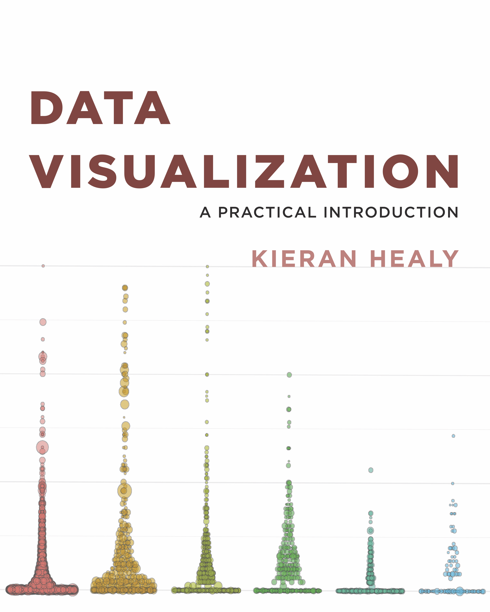

```{r setup, include=FALSE, purl=FALSE}
options(htmltools.dir.version = FALSE, width = 70)
knitr::opts_chunk$set(comment = "##")
```

class: inverse

# Topics

Last time, we learned about,

1. R and RStudio
1. RMarkdown headers, syntax, and chunks
1. Basics of functions, objects, and vectors
1. Dataframes and basic plots

--

Today, we will cover,

1. Useful coding tips: packages, directories, and saving data
1. Basics of ggplot: layers and aesthetics
1. Advanced ggplot tools

---
class: inverse 

# 1. Useful Coding Tips

---

# Packages 

Packages are **collections of functions and tools** that make your life easier! The best part of R is the huge number of user-created packages. The `Packages` tab in the bottom-left pane of RStudio lists your installed packages.

--

To install a new package in R, run the line of code:
```{r eval=FALSE}
install.packages("gapminder") 
```
We always install packages in the **console**, because we only want to do it **once**

---

# Loading Packages

Installing a packages *does not* mean it's loaded in our R session. To do so, we call the package:

```{r eval=FALSE}
library(gapminder)
```

**NOTE:** Use quotes when installing packages, but not when loading packages!

--

We need to run this code every time we open a new R session: **Where should we put this code?**

--

**Answer:** In R/Rmd files, and not the console!

---

# Working Directories

R saves files and looks for files to open in your current **working directory**. You
can ask R what this is:

```{r}
getwd()
```

--

Similarly, we can set a working directory like so:

```{r, eval=FALSE}
setwd("C:/Users/pearce790/CSSS508/HW2")
```

--

*Don't set a working directory in R Markdown documents!* They automatically set the directory they are in as the working directory.


---

# Managing Files

When managing R projects, it is normally best to give each project (such as a homework
assignment) its own folder. I use the following system:

* Every class or project has its own folder

* Each assignment or task has a folder inside that, which is the working directory for that item.

* `.Rmd` and `.R` files are named clearly and completely

--

For example, this presentation is located and named this:
`GitHub/CSSS508/Lectures/Lecture2/CSSS508_Lecture2_ggplot2.Rmd`

**Be consistent** so your projects are organized! You don't want to lose files!!


---
class: inverse

# Aside: Gapminder Data

---

# Gapminder Data

In today's lecture and Homework 2, we'll use data from Hans Rosling's [Gapminder](http://www.gapminder.org) project. The data can be accessed through the `gaminder` R package.

--

If you didn't already, run in the console: `install.packages("gapminder")`, and then load the package:

```{r}
library(gapminder)
```

---

# Exploring Gapminder

The data is in a dataframe called `gapminder`, which is available after loading the package. Let's explore it using functions from last week:

.small[
```{r}
str(gapminder)
```
]

---

# What's Interesting Here?

* **Factor** variables `country` and `continent`

   + Factors are categorical data
   + We'll spend a lot of time on factors later!

--

* Many observations: $n=`r nrow(gapminder)`$ rows

--

* For each observation, a few variables: $p=`r ncol(gapminder)`$ columns

--

* A nested/hierarchical structure: `year` in `country` in `continent`

   + These are panel data!


---
class: inverse

# 2. Basics of `ggplot2`


---

## Basic Plots

.pull-left[
 .small[
```{r, eval=FALSE}
China <- subset(gapminder,
          gapminder$country == "China")
plot(lifeExp ~ year, 
     data = China, 
     xlab = "Year", 
     ylab = "Life expectancy",
     main = "Life expectancy in China", 
     col = "red", 
     pch = 16)
```

 ]
 The plot is made with *one function* and *many arguments*
]

.pull-right[
```{r, echo=FALSE}
China <- subset(gapminder,gapminder$country == "China")
plot(lifeExp ~ year, data = China, xlab = "Year", ylab = "Life expectancy",
     main = "Life expectancy in China", col = "red", pch = 16)
```
]

Note: Don't worry about the code used to create the object `China`. We'll explore data manipulation next week!


---
## Fancier: `ggplot`


.pull-left[
 .small[
```{r,  dev='svg', eval=FALSE}
ggplot(data = China, 
       aes(x = year, y = lifeExp)) +
  geom_point(color = "red", size = 3) +
  xlab("Year") + 
  ylab("Life expectancy") +
  ggtitle("Life expectancy in China") +
  theme_bw(base_size=18)
```
  ]
  This `ggplot` is made with *many functions* and *fewer arguments* in each.
]

.pull-right[
```{r,  dev='svg', warning=FALSE, message=FALSE, echo=FALSE}
library(ggplot2)
ggplot(data = China, 
       aes(x = year, y = lifeExp)) +
  geom_point(color = "red", size = 3) +
  xlab("Year") + 
  ylab("Life expectancy") +
  ggtitle("Life expectancy in China") +
  theme_bw(base_size=18)
detach("package:ggplot2")
```
]

---
# `ggplot2`

The ``ggplot2` package provides an alternative toolbox for plotting.


```{r}
# install.packages("ggplot2")
library(ggplot2)
```

The core idea underlying this package is the [**layered grammar of graphics**](https://doi.org/10.1198/jcgs.2009.07098): we can break up elements of a plot into pieces and combine them.

--

`ggplot`s are a bit harder to create, but are usually: 

* prettier, 
* more professional, and
* more customizable!


---
# Structure of a ggplot

`ggplot2` graphics objects consist of two primary components:

--

1. **Layers**, the components of a graph.

   * We *add* layers to a `ggplot2` object using `+`.
   * This includes adding lines, shapes, and text to a plot.

--

2. **Aesthetics**, which determine how the layers appear.

   * We *set* aesthetics using *arguments* (e.g. `color="red"`) inside layer functions.
   * This includes modifying locations, colors, and sizes of the layers.

---

# Layers

**Layers** are the components of the graph, such as:

* `ggplot()`: initializes basic plotting object, specifies input data
* `geom_point()`: layer of scatterplot points
* `geom_line()`: layer of lines
* `geom_histogram()`: layer of a histogram
* `ggtitle()`, `xlab()`, `ylab()`: layers of labels
* `facet_wrap()`: layer creating multiple plot panels
* `theme_bw()`: layer replacing default gray background with black-and-white

Layers are separated by a `+` sign. For clarity, I usually put each layer on a new line.

---

# Aesthetics

**Aesthetics** control the appearance of the layers:

* `x`, `y`: $x$ and $y$ coordinate values to use
* `color`: set color of elements based on some data value
* `group`: describe which points are conceptually grouped together for the plot (often used with lines)
* `size`: set size of points/lines based on some data value (greater than 0)
* `alpha`: set transparency based on some data value (between 0 and 1)


---
class: inverse

# Examples: Basic Jargon in Action!

We'll now build up two `ggplot`s together that demonstrate common layers and aesthetics.

---

## Axis Labels, Points, No Background

### 1: Base Plot

.pull-left[
 .small[
```{r, fig.height=4, dev='svg', eval=FALSE}
ggplot(data = China,  #<<
       aes(x = year, y = lifeExp)) #<<
```
]
]
.pull-right[
```{r, dev='svg', echo=FALSE}
ggplot(data = China,  
       aes(x = year, y = lifeExp)) 
```
]

.footnote[Initialize the plot with `ggplot()` and `x` and `y` aesthetics **mapped** to variables. These aesthetics will be accessible to any future layers since they're in the primary layer.]

---


## Axis Labels, Points, No Background

### 2: Scatterplot

.pull-left[
 .small[
```{r, fig.height=4, dev='svg', eval=FALSE}
ggplot(data = China, 
       aes(x = year, y = lifeExp)) +
  geom_point() #<<
```
]
]
.pull-right[
```{r,  dev='svg', echo=FALSE}
ggplot(data = China, 
       aes(x = year, y = lifeExp)) +
  geom_point() 
```
]

.footnote[Add a scatterplot **layer**.]
---


## Axis Labels, Points, No Background

### 3: Point Color and Size

.pull-left[
 .small[
```{r, fig.height=4, dev='svg', eval=FALSE}
ggplot(data = China, 
       aes(x = year, y = lifeExp)) +
  geom_point(color = "red", size = 3) #<<
```
]
]
.pull-right[
```{r,  dev='svg', echo=FALSE}
ggplot(data = China, 
       aes(x = year, y = lifeExp)) +
  geom_point(color = "red", size = 3) 
```
]

.footnote[**Set** aesthetics to make the points large and red.]
---


## Axis Labels, Points, No Background

### 4: X-Axis Label

.pull-left[
 .small[
```{r, fig.height=4, dev='svg', eval=FALSE}
ggplot(data = China, 
       aes(x = year, y = lifeExp)) +
  geom_point(color = "red", size = 3) +
  xlab("Year") #<<
```
]
]
.pull-right[
```{r,  dev='svg', echo=FALSE}
ggplot(data = China, 
       aes(x = year, y = lifeExp)) +
  geom_point(color = "red", size = 3) +
  xlab("Year") 
```
]

.footnote[Add a layer to capitalize the x-axis label.]
---


## Axis Labels, Points, No Background

### 5: Y-Axis Label

.pull-left[
 .small[
```{r, fig.height=4, dev='svg', eval=FALSE}
ggplot(data = China, 
       aes(x = year, y = lifeExp)) +
  geom_point(color = "red", size = 3) +
  xlab("Year") + 
  ylab("Life expectancy") #<<
```
]
]
.pull-right[
```{r,  dev='svg', echo=FALSE}
ggplot(data = China, 
       aes(x = year, y = lifeExp)) +
  geom_point(color = "red", size = 3) +
  xlab("Year") + 
  ylab("Life expectancy")
```
]

.footnote[Add a layer to clean up the y-axis label.]
---


## Axis Labels, Points, No Background

### 6: Title

.pull-left[
 .small[
```{r, fig.height=4, dev='svg', eval=FALSE}
ggplot(data = China, 
       aes(x = year, y = lifeExp)) +
  geom_point(color = "red", size = 3) +
  xlab("Year") + 
  ylab("Life expectancy") +
  ggtitle("Life expectancy in China") #<<
```
]
]
.pull-right[
```{r,  dev='svg', echo=FALSE}
ggplot(data = China, 
       aes(x = year, y = lifeExp)) +
  geom_point(color = "red", size = 3) +
  xlab("Year") + 
  ylab("Life expectancy") +
  ggtitle("Life expectancy in China")
```
]

.footnote[Add a title layer.]
---


## Axis Labels, Points, No Background

### 7: Theme

.pull-left[
 .small[
```{r, fig.height=4, dev='svg', eval=FALSE}
ggplot(data = China, 
       aes(x = year, y = lifeExp)) +
  geom_point(color = "red", size = 3) +
  xlab("Year") + 
  ylab("Life expectancy") +
  ggtitle("Life expectancy in China") +
  theme_bw() #<<
```
]
]
.pull-right[
```{r,  dev='svg', echo=FALSE}
ggplot(data = China, 
       aes(x = year, y = lifeExp)) +
  geom_point(color = "red", size = 3) +
  xlab("Year") + 
  ylab("Life expectancy") +
  ggtitle("Life expectancy in China") +
  theme_bw() #<<
```
]

.footnote[Pick a nicer theme with a new layer.]
---


## Axis Labels, Points, No Background

### 8: Text Size

.pull-left[
 .small[
```{r, fig.height=4, dev='svg', eval=FALSE}
ggplot(data = China, 
       aes(x = year, y = lifeExp)) +
  geom_point(color = "red", size = 3) +
  xlab("Year") + 
  ylab("Life expectancy") +
  ggtitle("Life expectancy in China") +
  theme_bw(base_size=18) #<<
```
]
]
.pull-right[
```{r,  dev='svg', echo=FALSE}
ggplot(data = China, 
       aes(x = year, y = lifeExp)) +
  geom_point(color = "red", size = 3) +
  xlab("Year") + 
  ylab("Life expectancy") +
  ggtitle("Life expectancy in China") +
  theme_bw(base_size=18) #<<
```
]

.footnote[Increase the base text size.]
---
# Plotting All Countries

We have a plot we like for China... 

... but what if we want *all the countries*?

---


# Plotting All Countries

### 1: A Mess!
.pull-left[
 .small[
```{r, fig.height=4, dev='svg', eval=FALSE}
ggplot(data = gapminder,#<<
       aes(x = year, y = lifeExp)) +
  geom_point(color = "red", size = 3) +
  xlab("Year") + 
  ylab("Life expectancy") +
  ggtitle("Life expectancy over time") +
  theme_bw(base_size=18)
```
]
]
.pull-right[
```{r,  dev='svg', echo=FALSE}
ggplot(data = gapminder, #<<
       aes(x = year, y = lifeExp)) +
  geom_point(color = "red", size = 3) +
  xlab("Year") + 
  ylab("Life expectancy") +
  ggtitle("Life expectancy over time") +
  theme_bw(base_size=18)
```
]

.footnote[We can't tell countries apart! Maybe we could follow *lines*?]

---


# Plotting All Countries

### 2: Lines
.pull-left[
 .small[
```{r, fig.height=4, dev='svg', eval=FALSE}
ggplot(data = gapminder, 
       aes(x = year, y = lifeExp)) +
  geom_line(color = "red", size = 3) + #<<
  xlab("Year") + 
  ylab("Life expectancy") +
  ggtitle("Life expectancy over time") +
  theme_bw(base_size=18)
```
]
]
.pull-right[
```{r,  dev='svg', echo=FALSE}
ggplot(data = gapminder, 
       aes(x = year, y = lifeExp)) +
  geom_line(color = "red", size = 3) + #<<
  xlab("Year") + 
  ylab("Life expectancy") +
  ggtitle("Life expectancy over time") +
  theme_bw(base_size=18)
```
]

.footnote[`ggplot2` doesn't know how to connect the lines!]

---


# Plotting All Countries

### 3: Grouping
.pull-left[
 .small[
```{r, fig.height=4, dev='svg', eval=FALSE}
ggplot(data = gapminder, 
       aes(x = year, y = lifeExp, 
           group = country)) + #<<
  geom_line(color = "red", size = 3) +
  xlab("Year") + 
  ylab("Life expectancy") +
  ggtitle("Life expectancy over time") +
  theme_bw(base_size=18)
```
]
]
.pull-right[
```{r,  dev='svg', echo=FALSE}
ggplot(data = gapminder, 
       aes(x = year, y = lifeExp, 
           group = country)) + #<<
  geom_line(color = "red", size = 3) +
  xlab("Year") + 
  ylab("Life expectancy") +
  ggtitle("Life expectancy over time") +
  theme_bw(base_size=18)
```
]

.footnote[That looks more reasonable... but the lines are too thick!]
---


# Plotting All Countries

### 4: Size
.pull-left[
 .small[
```{r, fig.height=4, dev='svg', eval=FALSE}
ggplot(data = gapminder, 
       aes(x = year, y = lifeExp, 
           group = country)) +
  geom_line(color = "red") + #<<
  xlab("Year") + 
  ylab("Life expectancy") +
  ggtitle("Life expectancy over time") +
  theme_bw(base_size=18)
```
]
]
.pull-right[
```{r,  dev='svg', echo=FALSE}
ggplot(data = gapminder, 
       aes(x = year, y = lifeExp, 
           group = country)) +
  geom_line(color = "red") + #<<
  xlab("Year") + 
  ylab("Life expectancy") +
  ggtitle("Life expectancy over time") +
  theme_bw(base_size=18)
```
]

.footnote[Much better... but maybe we can do highlight regional differences?]

---


# Plotting All Countries

### 5: Color
.pull-left[
 .small[
```{r, fig.height=4, dev='svg', eval=FALSE}
ggplot(data = gapminder, 
       aes(x = year, y = lifeExp, 
           group = country, 
           color = continent)) + #<<
  geom_line() + #<<
  xlab("Year") + 
  ylab("Life expectancy") +
  ggtitle("Life expectancy over time") +
  theme_bw(base_size=18)
```
]
]
.pull-right[
```{r,  dev='svg', echo=FALSE}
ggplot(data = gapminder, 
       aes(x = year, y = lifeExp, 
           group = country, 
           color = continent)) + #<<
  geom_line() + #<<
  xlab("Year") + 
  ylab("Life expectancy") +
  ggtitle("Life expectancy over time") +
  theme_bw(base_size=18) #<<
```
]

.footnote[Patterns are obvious... but why not separate continents completely?]

---


# Plotting All Countries

### 6: Facets
.pull-left[
 .small[
```{r, fig.height=4, dev='svg', eval=FALSE}
ggplot(data = gapminder, 
       aes(x = year, y = lifeExp, 
           group = country, 
           color = continent)) +
  geom_line() +
  xlab("Year") + 
  ylab("Life expectancy") +
  ggtitle("Life expectancy over time") +
  theme_bw(base_size=18) + 
  facet_wrap(~ continent) #<<
```
]
]
.pull-right[
```{r,  dev='svg', echo=FALSE}
ggplot(data = gapminder, 
       aes(x = year, y = lifeExp, 
           group = country, 
           color = continent)) +
  geom_line() +
  xlab("Year") + 
  ylab("Life expectancy") +
  ggtitle("Life expectancy over time") +
  theme_bw(base_size=18) +
  facet_wrap(~ continent) #<<
```
]

.footnote[Now the text is too big!]
---


# Plotting All Countries

### 7: Text Size
.pull-left[
 .small[
```{r, fig.height=4, dev='svg', eval=FALSE}
ggplot(data = gapminder, 
       aes(x = year, y = lifeExp, 
           group = country, 
           color = continent)) +
  geom_line() +
  xlab("Year") + 
  ylab("Life expectancy") +
  ggtitle("Life expectancy over time") +
  theme_bw() +  #<<
  facet_wrap(~ continent)
```
]
]
.pull-right[
```{r,  dev='svg', echo=FALSE}
ggplot(data = gapminder, 
       aes(x = year, y = lifeExp, 
           group = country, 
           color = continent)) +
  geom_line() +
  xlab("Year") + 
  ylab("Life expectancy") +
  ggtitle("Life expectancy over time") +
  theme_bw() + #<<
  facet_wrap(~ continent)
```
]

.footnote[Better. Do we even need the legend anymore?]

---


# Plotting All Countries

### 8: No Legend
.pull-left[
 .small[
```{r, fig.height=4, dev='svg', eval=FALSE}
ggplot(data = gapminder, 
       aes(x = year, y = lifeExp, 
           group = country, 
           color = continent)) +
  geom_line() +
  xlab("Year") + 
  ylab("Life expectancy") +
  ggtitle("Life expectancy over time") +
  theme_bw() +  
  facet_wrap(~ continent) +
  theme(legend.position = "none") #<<
```
]
]
.pull-right[
```{r,  dev='svg', echo=FALSE}
ggplot(data = gapminder, 
       aes(x = year, y = lifeExp, 
           group = country, 
           color = continent)) +
  geom_line() +
  xlab("Year") + 
  ylab("Life expectancy") +
  ggtitle("Life expectancy over time") +
  theme_bw() + 
  facet_wrap(~ continent) +
  theme(legend.position = "none") #<<
```
]

.footnote[Looking good!]


---
class: inverse

# 4. Advanced ggplot tools

Next, we'll discuss:

* Storing, modifying, and saving ggplots

* Advanced axis changes (scales, text, ticks)

* Legend changes (scales, colors, locations)

---

# Storing Plots

We can assign a `ggplot` object to a name:

```{r}
lifeExp_by_year <- 
  ggplot(data = gapminder, 
       aes(x = year, y = lifeExp, 
           group = country, 
           color = continent)) +
  geom_line() +
  xlab("Year") + 
  ylab("Life expectancy") +
  ggtitle("Life expectancy over time") +
  theme_bw() + 
  facet_wrap(~ continent) +
  theme(legend.position = "none")
```

Afterwards, you can display or modify `ggplot`s...

---

# Showing a Stored Graph

```{r, fig.height=4, dev='svg'}
lifeExp_by_year
```

---

# Adding More Layers

```{r, fig.height=4, dev='svg'}
lifeExp_by_year +
    theme(legend.position = "bottom")
```


---

# Saving `ggplot` Plots

If you want to save a ggplot, use `ggsave()`:

```{r, eval=FALSE}
ggsave("I_saved_a_file.pdf", plot = lifeExp_by_year,
       height = 3, width = 5, units = "in")
```

If you didn't manually set font sizes, these will usually come out at a reasonable size given the dimensions of your output file.

---

# Changing the Axes

We can modify the axes in a variety of ways, such as:

* Change the $x$ or $y$ range using `xlim()` or `ylim()` layers

* Change to a logarithmic or square-root scale on either axis: `scale_x_log10()`, `scale_y_sqrt()`

* Change where the major/minor breaks are: `scale_x_continuous(breaks =, minor_breaks = )`

---

# Axis Changes

```{r, fig.height=3.5, dev='svg'}
ggplot(data = China, aes(x = year, y = gdpPercap)) +
    geom_line() +
    scale_y_log10(breaks = c(1000, 2000, 3000, 4000, 5000)) #<<
    xlim(1940, 2010) + ggtitle("Chinese GDP per capita")
```

---

# Fonts Too Small?

```{r, fig.height=3.5, dev='svg'}
ggplot(data = China, aes(x = year, y = lifeExp)) +
    geom_line() +
    ggtitle("Chinese life expectancy") +
    theme_gray(base_size = 20) #<<
```


---

## Precise Legend Position
.small[
```{r, fig.height=4, dev='svg'}
lifeExp_by_year +
  theme(legend.position = c(0.8, 0.2)) 
```
]

Instead of coordinates, you could also use "top", "bottom", "left", or "right".


---


# Scales for Color, Shape, etc.

**Scales** are layers that control how the mapped aesthetics appear. 

You can modify these with a `scale_[aesthetic]_[option]()` layer:

--

* `[aesthetic]` is `color`, `shape`, `linetype`, `alpha`, `size`, `fill`, etc.

--

* `[option]` is something like `manual`, `continuous` or `discrete` (depending on nature of the variable).

--

**Examples:**

* `scale_linetype_manual()`: manually specify the linetype for each different value
* `scale_color_manual()`: manually specify colors

---

## Legend Name and Manual Colors
.small[
```{r, fig.height=4, dev='svg'}
lifeExp_by_year +
  theme(legend.position = c(0.8, 0.2)) +
  scale_color_manual(
    name = "Which continent are\nwe looking at?", # \n adds a line break #<<
    values = c("Africa" = "seagreen", "Americas" = "turquoise1", 
               "Asia" = "royalblue", "Europe" = "violetred1", "Oceania" = "yellow"))
```
]

---
class: inverse

# Bonus: Advanced Example!


---

## End Result

We're going to *slowly* build up a *really detailed plot* now!

```{r, echo=FALSE, fig.height=4.5, dev='svg', fig.show="hold", warning=FALSE, message=FALSE}
ggplot(data = gapminder, aes(x = year, y = lifeExp, group = country)) +
  geom_line(alpha = 0.5, aes(color = "Country", size = "Country")) +
  geom_line(stat = "smooth", method = "loess", 
            aes(group = continent, color = "Continent", size = "Continent"), alpha = 0.5) +
  facet_wrap(~ continent, nrow = 2) +
  scale_color_manual(name = "Life Exp. for:", values = c("Country" = "black", "Continent" = "blue")) +
  scale_size_manual(name = "Life Exp. for:", values = c("Country" = 0.25, "Continent" = 3)) +
  theme_minimal(base_size = 14) + ylab("Years") + xlab("") + 
  ggtitle("Life Expectancy, 1952-2007", subtitle = "By continent and country") +
  theme(legend.position=c(0.82, 0.15), axis.text.x = element_text(angle = 45)) #<<
```


---
## 1. Base Plot
.smaller[
```{r, echo=TRUE, fig.height=3.5, dev='svg', fig.show="hold", warning=FALSE}
ggplot(data = gapminder, aes(x = year, y = lifeExp, group = country)) #<<
  #
  #
  #  
  #
  #
  #
  #
  #
  #
```
]

---


## 2. Lines

.smaller[
```{r, echo=TRUE, fig.height=3.5, dev='svg', fig.show="hold", warning=FALSE, message=FALSE}
ggplot(data = gapminder, aes(x = year, y = lifeExp, group = country)) +
  geom_line() #<<
  #
  #  
  #
  #
  #
  #
  #
  #
```
]
---


## 3. Continent Average

.smaller[
```{r, echo=TRUE, fig.height=3.5, dev='svg', fig.show="hold", warning=FALSE, message=FALSE}
ggplot(data = gapminder, aes(x = year, y = lifeExp, group = country)) +
  geom_line() +
  geom_line(stat = "smooth", method = "loess", #<<
            aes(group = continent)) #<<
  #
  #
  #
  #
  #
  #
```
]

.footnote[Note: A [*loess* curve](https://en.wikipedia.org/wiki/Local_regression) is something like a moving average.]
---


## 4. Facets

.smaller[
```{r, echo=TRUE, fig.height=3.5, dev='svg', fig.show="hold", warning=FALSE, message=FALSE}
ggplot(data = gapminder, aes(x = year, y = lifeExp, group = country)) +
  geom_line() +
  geom_line(stat = "smooth", method = "loess", 
            aes(group = continent)) +
  facet_wrap(~ continent, nrow = 2) #<<
  #
  #
  #
  #
  #
```
]

---


## 5. Color Scale

.smaller[
```{r, echo=TRUE, fig.height=3.5, dev='svg', fig.show="hold", warning=FALSE, message=FALSE}
ggplot(data = gapminder, aes(x = year, y = lifeExp, group = country)) +
  geom_line(aes(color = "Country")) + #<<
  geom_line(stat = "smooth", method = "loess", 
            aes(group = continent, color = "Continent")) + #<<
  facet_wrap(~ continent, nrow = 2) +
  scale_color_manual(name = "Life Exp. for:", values = c("Country" = "black", "Continent" = "blue")) #<<
  #
  #
  #
  #
```
]
---


## 6. Size Scale
.smaller[
```{r, echo=TRUE, fig.height=3.5, dev='svg', fig.show="hold", warning=FALSE, message=FALSE}
ggplot(data = gapminder, aes(x = year, y = lifeExp, group = country)) +
  geom_line(aes(color = "Country", size = "Country")) + #<<
  geom_line(stat = "smooth", method = "loess", 
            aes(group = continent, color = "Continent", size = "Continent")) + #<<
  facet_wrap(~ continent, nrow = 2) +
  scale_color_manual(name = "Life Exp. for:", values = c("Country" = "black", "Continent" = "blue")) +
  scale_size_manual(name = "Life Exp. for:", values = c("Country" = 0.25, "Continent" = 3)) #<<
  #
  #
  #
```
]
---


## 7. Alpha (Transparency)

.smaller[
```{r, echo=TRUE, fig.height=3.5, dev='svg', fig.show="hold", warning=FALSE, message=FALSE}
ggplot(data = gapminder, aes(x = year, y = lifeExp, group = country)) +
  geom_line(alpha = 0.5, aes(color = "Country", size = "Country")) + #<<
  geom_line(stat = "smooth", method = "loess", 
            aes(group = continent, color = "Continent", size = "Continent"), alpha = 0.5) + #<<
  facet_wrap(~ continent, nrow = 2) +
  scale_color_manual(name = "Life Exp. for:", values = c("Country" = "black", "Continent" = "blue")) +
  scale_size_manual(name = "Life Exp. for:", values = c("Country" = 0.25, "Continent" = 3))
  #
  #
  #
```
]

---


## 8. Theme and Labels

.smaller[
```{r, echo=TRUE, fig.height=3.5, dev='svg', fig.show="hold", warning=FALSE, message=FALSE}
ggplot(data = gapminder, aes(x = year, y = lifeExp, group = country)) +
  geom_line(alpha = 0.5, aes(color = "Country", size = "Country")) +
  geom_line(stat = "smooth", method = "loess", 
            aes(group = continent, color = "Continent", size = "Continent"), alpha = 0.5) +
  facet_wrap(~ continent, nrow = 2) +
  scale_color_manual(name = "Life Exp. for:", values = c("Country" = "black", "Continent" = "blue")) +
  scale_size_manual(name = "Life Exp. for:", values = c("Country" = 0.25, "Continent" = 3)) +
  theme_minimal(base_size = 14) + ylab("Years") + xlab("") #<<
  #
  #
```
]
---


## 9. Title and Subtitle

.smaller[
```{r, echo=TRUE, fig.height=3.5, dev='svg', fig.show="hold", warning=FALSE, message=FALSE}
ggplot(data = gapminder, aes(x = year, y = lifeExp, group = country)) +
  geom_line(alpha = 0.5, aes(color = "Country", size = "Country")) +
  geom_line(stat = "smooth", method = "loess", 
            aes(group = continent, color = "Continent", size = "Continent"), alpha = 0.5) +
  facet_wrap(~ continent, nrow = 2) +
  scale_color_manual(name = "Life Exp. for:", values = c("Country" = "black", "Continent" = "blue")) +
  scale_size_manual(name = "Life Exp. for:", values = c("Country" = 0.25, "Continent" = 3)) +
  theme_minimal(base_size = 14) + ylab("Years") + xlab("") + 
  ggtitle("Life Expectancy, 1952-2007", subtitle = "By continent and country") #<<
  #
```
]
---


## 10. Angled Tick Values

.smaller[
```{r, echo=TRUE, fig.height=3.5, dev='svg', fig.show="hold", warning=FALSE, message=FALSE}
ggplot(data = gapminder, aes(x = year, y = lifeExp, group = country)) +
  geom_line(alpha = 0.5, aes(color = "Country", size = "Country")) +
  geom_line(stat = "smooth", method = "loess", 
            aes(group = continent, color = "Continent", size = "Continent"), alpha = 0.5) +
  facet_wrap(~ continent, nrow = 2) +
  scale_color_manual(name = "Life Exp. for:", values = c("Country" = "black", "Continent" = "blue")) +
  scale_size_manual(name = "Life Exp. for:", values = c("Country" = 0.25, "Continent" = 3)) +
  theme_minimal(base_size = 14) + ylab("Years") + xlab("") + 
  ggtitle("Life Expectancy, 1952-2007", subtitle = "By continent and country") +
  theme(axis.text.x = element_text(angle = 45)) #<<
```
]

.footnote[Note: Fewer values might be better than angled labels!]
---


## 11. Legend Position

.smaller[
```{r, echo=TRUE, fig.height=3.5, dev='svg', fig.show="hold", warning=FALSE, message=FALSE}
ggplot(data = gapminder, aes(x = year, y = lifeExp, group = country)) +
  geom_line(alpha = 0.5, aes(color = "Country", size = "Country")) +
  geom_line(stat = "smooth", method = "loess", 
            aes(group = continent, color = "Continent", size = "Continent"), alpha = 0.5) +
  facet_wrap(~ continent, nrow = 2) +
  scale_color_manual(name = "Life Exp. for:", values = c("Country" = "black", "Continent" = "blue")) +
  scale_size_manual(name = "Life Exp. for:", values = c("Country" = 0.25, "Continent" = 3)) +
  theme_minimal(base_size = 14) + ylab("Years") + xlab("") + 
  ggtitle("Life Expectancy, 1952-2007", subtitle = "By continent and country") +
  theme(legend.position=c(0.82, 0.15), axis.text.x = element_text(angle = 45)) #<<
```
]

---
class:inverse

# Summary

---

## Summary

`ggplot2` can do a LOT! I won't expect you to remember all these tools.

  
.pull-left[
.small[
* With time and practice, you'll start to remember the key tools

* When in doubt, Google it! ("*R ggplot rename title*")

* There are lots of great resources out there:

  + The [Cookbook for R website](http://www.cookbook-r.com/Graphs/Legends_%28ggplot2%29)
  
  + The [RStudio ggplot Cheatsheets](https://www.rstudio.com/wp-content/uploads/2016/11/ggplot2-cheatsheet-2.1.pdf).
  
  + Kieran Healy's book [Data Visualization: A Practical Introduction](https://socviz.co/) (right) which is targeted at social scientists without technical backgrounds.
]
]
.pull-right[

]

---
class: inverse

# Exercise: Histograms

In pairs, you will create a histogram of life expectancy observations in the complete Gapminder dataset.

1. Set the base layer by specifying the data as `gapminder` and the x variable as `lifeExp`

2. Add a second layer to create a histogram using the function `geom_histogram()`

3. Customize your plot with nice axis labels and a title. 

---

# My Solution

### 1: Set Base Layer
.pull-left[
 .small[
```{r, fig.height=4, dev='svg', eval=FALSE}
ggplot(gapminder,aes(x=lifeExp))
```
]
]
.pull-right[
```{r,  dev='svg', echo=FALSE}
ggplot(gapminder,aes(x=lifeExp))
```
]


---

# My Solution

### 2: Add Histogram Layer
.pull-left[
 .small[
```{r, fig.height=4, dev='svg', eval=FALSE}
ggplot(gapminder,aes(x=lifeExp))+
  geom_histogram(bins=30)
```
]
]
.pull-right[
```{r,  dev='svg', echo=FALSE}
ggplot(gapminder,aes(x=lifeExp))+
  geom_histogram(bins=30)
```
]

.footnote[Setting the `bins` aesthetic removes a pesky message!]

---

# My Solution

### 3: Add Label Layers
.pull-left[
 .small[
```{r, fig.height=4, dev='svg', eval=FALSE}
ggplot(gapminder,aes(x=lifeExp))+
  geom_histogram(bins=30)+
  xlab("Life Expectancy")+
  ylab("Count")+
  ggtitle("Histogram of Life Expectancy 
          in Gapminder Data")
```
]
]
.pull-right[
```{r,  dev='svg', echo=FALSE}
ggplot(gapminder,aes(x=lifeExp))+
  geom_histogram(bins=30)+
  xlab("Life Expectancy")+
  ylab("Count")+
  ggtitle("Histogram of Life Expectancy in Gapminder Data")
```
]

---
class: inverse

# Homework 2

In this homework, you'll pose a question regarding the Gapminder dataset and investigate it graphically. 

* At the beginning of your document, write down a research question that is based on the Gapminder dataset (e.g., "How does population change over time in different countries?")
* Create 3-6 plots to answer/investigate your research question. Consider histograms (`geom_histogram()`), scatterplots (`geom_point()`), or lineplots (`geom_line()`).
* Be sure all titles, axes, and legends are clearly labelled.
* Include at least one plot with `facet_wrap()` or `facet_grid()`.

Your document should be pleasant for a peer to look at, with some organization. You must write up your observations in words as well as showing the graphs. Upload both the `.Rmd` file and the `.html` file to Canvas. 
