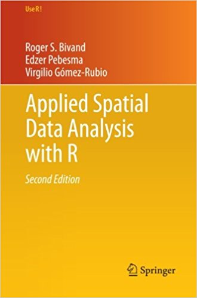

class:inverse
```{r setup, include=FALSE, purl=FALSE}
options(htmltools.dir.version = FALSE, width = 70)
knitr::opts_chunk$set(comment = "##")
```

# Topics

Last time, we learned about,

1. Basics of Strings
1. Strings in Base R
1. Strings in `stringr` (Tidyverse)

--

Today, we will cover,

1. `ggmap` for mapping in `ggplot2`
2. Density plots
3. Labeling points


---
# Mapping in R: A quick plug

.pull-left[
.image-75[

]
]

.pull-right[

Mapping can be **complex!** If you are interested in digging deeper, here are some resources:

* If you are interested in mapping, GIS, and geospatial analysis in R, *acquire this book*.

* [RSpatial.org](http://rspatial.org/) is a great resource for working with spatial data.

* For more information on *spatial statistics*, consider taking Jon Wakefield's **CSSS 554: Statistical Methods for Spatial Data** this winter.

]

---
class: inverse
# 1. `ggmap`

---
## One Day of SPD Incidents

Today, we'll study data from the Seattle Police Department regarding incidents on just one day: March 25, 2016. 

--

The data can be downloaded from my predecessor's Github using the code below (code in the R companion file).


```{r, message=FALSE, warning=FALSE}
library(ggplot2)
library(readr)
library(dplyr)
```
```{r read_spd_data, cache=FALSE, message=FALSE, warning=FALSE}
spd_raw <- read_csv("https://clanfear.github.io/CSSS508/Seattle_Police_Department_911_Incident_Response.csv")
```

---
## Taking a `glimpse()`

.small[
```{r}
glimpse(spd_raw)
```
]

What does each **row represent?** What are the **variables and values?**

---
## Simple Plotting: Regular `ggplots`


.pull-left[
Coordinates, such as longitude and latitude, can be provided in `aes()` as `x` and `y` values.

This is ideal when you don't need to place points over some map for reference.

.small[
```{r, eval=FALSE}
ggplot(spd_raw, 
       aes(Longitude, Latitude)) + 
  geom_point() + 
  coord_fixed() + # evenly spaces x and y
  ggtitle("Seattle Police Incidents",
          subtitle="March 25, 2016") +
  theme_classic()
```
]

Sometimes, however, we want to plot these points over existing maps.

]

.pull-right[
```{r, message = FALSE, echo=FALSE, fig.height = 5.5, fig.width=3, dev="svg"}
ggplot(spd_raw, aes(Longitude, Latitude)) + 
  geom_point() + 
  coord_fixed() +
  ggtitle("Seattle Police Incidents", subtitle="March 25, 2016") +
  theme_classic()
```
]

---
## Better plots with `ggmap`

`ggmap` is a package that works with `ggplot2` to plot spatial data directly on map images.

--

What this package does for you:

1. Queries servers for a map at the location and scale you want

2. Plots the image as a `ggplot` object

3. Lets you add more `ggplot` layers like points, 2D density plots, text annotations

4. Additional functions for interacting with Google Maps (beyond this course)


---
## Installation

We can install `ggmap` like other packages:

```{r, eval=FALSE}
install.packages("ggmap")
```

**Note: If prompted to "install from sources the package which needs compilation", I find that typing "no" works best!**

Because the map APIs it uses change frequently, sometimes you may need to get a newer development version of `ggmap` from the author's GitHub. This can be done using the `remotes` package.

```{r, eval=FALSE}
if(!requireNamespace("remotes")){install.packages("remotes")}
remotes::install_github("dkahle/ggmap", ref = "tidyup")
```

Note, this may require compilation on your computer.

```{r, message=FALSE, warning=FALSE, purl=FALSE}
library(ggmap)
```

---
## Quick Maps with `qmplot()`

.pull-left[
`qmplot` will automatically set the map region based on your data:

```{r, eval=FALSE, purl=FALSE}
qmplot(data = spd_raw,
       x = Longitude, 
       y = Latitude)
```

All I provided was numeric latitude and longitude, and it placed the data points correctly on a raster map of Seattle.

]

.pull-right[
```{r qmplot, cache=TRUE, message = FALSE, echo=FALSE, fig.height = 5, fig.width=2.5, dev="svg"}
qmplot(data = spd_raw,
       x = Longitude, 
       y = Latitude)
```
]

---
## `get_map()`

`qmplot()` internally uses the function `get_map()`, which retrieves a base map layer. Some options:

* `location=` search query or numeric vector of longitude and latitude
* `zoom=` a zoom level (3 = continent, 10 = city, 21 = building)
* `maptype=`: `"watercolor"`, `"toner"`, `"toner-background"`, `"toner-lite"`
* `color=`: `"color"` or `"bw"`

--


There are fancier options available, but many require a Google Maps API. 

See the **help page** for `gmplot()` or `get_map` for more information!

---
## Nicer Example


.pull-left[

Let's add *color* to our plot from before
```{r, eval=FALSE, purl=FALSE}
qmplot(data = spd_raw,
       x = Longitude, 
       y = Latitude,
       color=I("navy")
)
```
`I()` is used here to specify *set* (constant) rather than *mapped* values.
]

.pull-right[
```{r cache=TRUE, message = FALSE, echo=FALSE, fig.height = 5, fig.width=2.5, dev="svg"}
qmplot(data = spd_raw,
       x = Longitude, 
       y = Latitude,
       color=I("navy")
)
```
]

---
## Nicer Example


.pull-left[

Add *transparency*

```{r, eval=FALSE, purl=FALSE}
qmplot(data = spd_raw,
       x = Longitude, 
       y = Latitude,
       color=I("navy"),
       alpha=I(0.5)
)
```
]
.pull-right[
```{r cache=TRUE, message = FALSE, echo=FALSE, fig.height = 5, fig.width=2.5, dev="svg"}
qmplot(data = spd_raw,
       x = Longitude, 
       y = Latitude,
       color=I("navy"),
       alpha=I(0.5)
)
```
]


---
class:inverse
# 2. Density plots

---
## Density Layers

.pull-left[

We can create a **spatial density plot** using the layer function `stat_density_2d()`:

* What to use when creating a "density" plot (where the observations occur)

* Aesthetics of the density plot

* Additional layer functions for customization

```{r eval=FALSE,echo=FALSE}
qmplot(data = spd_raw,
       geom = "blank", #<<
       x = Longitude, 
       y = Latitude,
       darken = 0.5)+
  stat_density_2d(
    aes(fill = stat(level)), #<<
    geom = "polygon", 
    alpha = .2, color = NA
  )+
  scale_fill_gradient2(
    "Incident\nConcentration", 
    low = "white", 
    mid = "yellow", 
    high = "red")+
  theme(legend.position = "bottom")
```
]

.pull-right[
```{r  echo=FALSE, message = FALSE, cache=TRUE, fig.height = 5, fig.width=2.5, dev="svg"}
qmplot(data = spd_raw,
       geom = "blank", #<<
       x = Longitude, 
       y = Latitude,
       darken = 0.5)+
  stat_density_2d(
    aes(fill = stat(level)), #<<
    geom = "polygon", 
    alpha = .2, color = NA
  )+
  scale_fill_gradient2(
    "Incident\nConcentration", 
    low = "white", 
    mid = "yellow", 
    high = "red")+
  theme(legend.position = "bottom")
```
]

---
## Basic Map

.pull-left[

Start with basic plot, remove points:

```{r eval=FALSE}
qmplot(data = spd_raw,
       geom = "blank", #<<
       x = Longitude, 
       y = Latitude)
```
]

.pull-right[
```{r  echo=FALSE, message = FALSE, cache=TRUE, fig.height = 5, fig.width=2.5, dev="svg"}
qmplot(data = spd_raw,
       geom = "blank", #<<
       x = Longitude, 
       y = Latitude)
```
]

---
## Add Density Layer

.pull-left[

Add `stat_density_2d` layer:

```{r eval=FALSE}
qmplot(data = spd_raw,
       geom = "blank",
       x = Longitude, 
       y = Latitude)+
  stat_density_2d( #<<
    aes(fill = stat(level)), #<<
    geom = "polygon") #<<
```

`stat(level)` indicates we want `fill=` to be based on `level` values calculated by the layer (i.e., number of observations).
]

.pull-right[
```{r  echo=FALSE, message = FALSE, cache=TRUE, fig.height = 6, fig.width=4, dev="svg"}
qmplot(data = spd_raw,
       geom = "blank",
       x = Longitude, 
       y = Latitude)+
  stat_density_2d( #<<
    aes(fill = stat(level)), #<<
    geom = "polygon") #<<
```
]


---
## Color Scale

.pull-left[

Specify color gradient

```{r eval=FALSE}
qmplot(data = spd_raw,
       geom = "blank",
       x = Longitude, 
       y = Latitude)+
  stat_density_2d(
    aes(fill = stat(level)),
    geom = "polygon", 
  )+
  scale_fill_gradient2( #<<
    low = "white", #<<
    mid = "yellow", #<<
    high = "red") #<<
```
]

.pull-right[
```{r  echo=FALSE, message = FALSE, cache=TRUE, fig.height = 6, fig.width=4, dev="svg"}
qmplot(data = spd_raw,
       geom = "blank",
       x = Longitude, 
       y = Latitude)+
  stat_density_2d(
    aes(fill = stat(level)),
    geom = "polygon", 
  )+
  scale_fill_gradient2( #<<
    low = "white", #<<
    mid = "yellow", #<<
    high = "red") #<<
```
]


---
## Customize transparency and legend

.pull-left[

.small[
```{r eval=FALSE}
qmplot(data = spd_raw,
       geom = "blank",
       x = Longitude, 
       y = Latitude,
       darken = 0.5)+ #<<
  stat_density_2d(
    aes(fill = stat(level)), 
    geom = "polygon", 
    alpha = .2, #<<
  )+
  scale_fill_gradient2(
    "Incident\nConcentration", #<<
    low = "white", 
    mid = "yellow", 
    high = "red")+
  theme(legend.position = "bottom") #<<
```
]

Done!

]

.pull-right[
```{r  echo=FALSE, message = FALSE, cache=TRUE, fig.height = 5, fig.width=2.5, dev="svg"}
qmplot(data = spd_raw,
       geom = "blank",
       x = Longitude, 
       y = Latitude,
       darken = 0.5)+ #<<
  stat_density_2d(
    aes(fill = stat(level)), 
    geom = "polygon", 
    alpha = .2, #<<
  )+
  scale_fill_gradient2(
    "Incident\nConcentration", #<<
    low = "white", 
    mid = "yellow", 
    high = "red")+
  theme(legend.position = "bottom") #<<
```
]
---
class:inverse
# 3. Labeling points

---
## Focus in on Downtown Seattle

First, let's filter our data to downtown based on values "eyeballed" from our earlier map:

```{r flag_assaults}
downtown <- spd_raw %>%
  filter(Latitude > 47.58, Latitude < 47.64,
         Longitude > -122.36, Longitude < -122.31)
```

We'll plot just these values from now on!

--

Let's also make a dataframe that includes just assaults and robberies downtown:

```{r}
assaults <- downtown %>% 
  filter(`Event Clearance Group` %in%
                  c("ASSAULTS", "ROBBERY")) %>%
  mutate(assault_label = `Event Clearance Description`)
```

We'll **label** these observations!

---
.pull-left[
## Labels

Now let's plot the events and label them with `geom_label()`:

.smallish[
```{r labels_1, eval=FALSE, purl=FALSE}
qmplot(data = downtown,
       x = Longitude,
       y = Latitude,
       maptype = "toner-lite",
       color = I("firebrick"),
       alpha = I(0.5)) +  
  geom_label(data = assaults, #<<
       aes(label = assault_label), #<<
       size=2) #<<
```
]

Note that one dataframe is used for points (`downtown`) and another for labels (`assaults`)!!

]

.pull-right[
```{r labels_2, echo=FALSE, message = FALSE, cache=TRUE, fig.height = 6, fig.width=3, dev="svg"}
qmplot(data = downtown,
       x = Longitude,
       y = Latitude,
       maptype = "toner-lite",
       color = I("firebrick"),
       alpha = I(0.5)) + 
  geom_label(data = assaults,
       aes(label = assault_label),
       size=2)
```
]

---
## Fixing Overlapping Labels

.pull-left[

The `ggrepel` package lets use fix or reduce overlapping labels using the function `geom_label_repel()`.

.small[
```{r ggrepel_1, eval=FALSE, purl=FALSE}
library(ggrepel)
qmplot(data = 
    downtown,
    x = Longitude,
    y = Latitude,
    maptype = "toner-lite", 
    color = I("firebrick"), 
    alpha = I(0.5)) + 
  geom_label_repel( #<<
    data = assaults,
    aes(label = assault_label), 
    size=2)
```
]
]

.pull-right[
```{r ggrepel_2, echo=FALSE, message = FALSE, cache=TRUE, warning=FALSE, fig.height = 5, fig.width=3, dev="svg"}
library(ggrepel)
qmplot(data = 
    downtown,
    x = Longitude,
    y = Latitude,
    maptype = "toner-lite", 
    color = I("firebrick"), 
    alpha = I(0.5)) + 
  geom_label_repel(
    data = assaults,
    aes(label = assault_label), 
    size=2)
```
]


---
class: inverse
# Lab/Homework

For the remainder of class, we'll use breakout rooms on Zoom to work on homework. Please *assign yourself* to a breakout room, then start working on Homework 8!

+ The first part is based on Lecture 8 (strings)
  + This includes lab questions from last lecture!
+ The second part is based on Lecture 9 (mapping)
  + This includes an analysis of the restaurant data from last week!

You can call me to your breakout room in Zoom! Otherwise, I will be moving between rooms.


